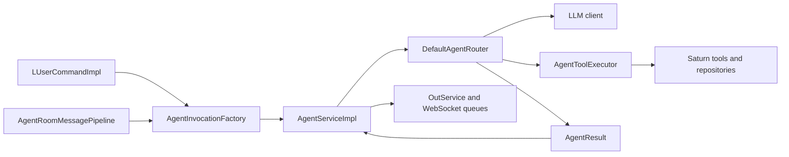
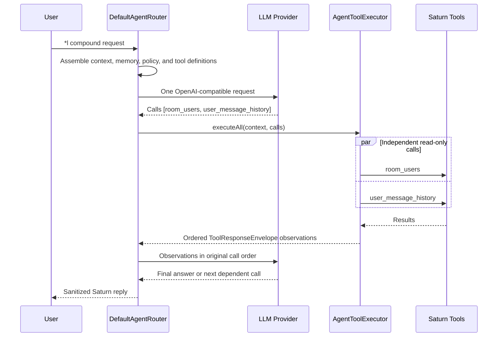

# Saturn agent architecture

## Purpose and document map

Saturn's agentic layer turns direct `*l` requests, exact mentions, approved ambient turns, and
autonomous moderation signals into bounded OpenAI-compatible tool-calling sessions. It orchestrates
existing Saturn commands, room state, and read-only persistence queries; it is not a second command
framework.

The package root is `org.saturn.app.agent`. Provider integration lives in `agent.llm`, concrete
tools in `agent.tool`, H2-backed context and memory in `agent.persistence`, and ambient abuse
monitoring in `agent.moderation`. `AgentRuntimeFactory` constructs the runtime.

The provider selects from advertised tools. Saturn remains authoritative for capability checks,
schema validation, ordering, timeouts, result validation, room delivery, and persistence.

Use this file as the current maintainer guide. The other agent documents have narrower roles:

| Document | Use it for |
| --- | --- |
| [`README.md`](README.md#vaelen-agent) | Operator setup, user-visible capabilities, and deployment. |
| [`TOOL_ROUTING_ARCHITECTURE.md`](TOOL_ROUTING_ARCHITECTURE.md) | The concise tool classification, batching, and ordering rules. |
| [`REFACTORING.md`](REFACTORING.md) | A compact summary of the implemented responsibility boundaries. |
| [`AGENT_REFACTOR.md`](AGENT_REFACTOR.md) | The completed refactor plan, acceptance evidence, coverage history, and intentional exclusions. |

## Package map

| Location | Responsibility |
| --- | --- |
| `org.saturn.app.agent` | Public contracts, immutable request models, configuration, runtime composition, routing policies, and the tool-execution facade. |
| `org.saturn.app.agent.llm` | Provider-neutral request/response records and the OpenAI-compatible HTTP client. |
| `org.saturn.app.agent.tool` | Built-in tools, Saturn command adapters, contextual command discovery, and engine-backed room access. |
| `org.saturn.app.agent.persistence` | H2 memory, named-query, schema, and generated-SQL repositories. |
| `org.saturn.app.agent.sql` | AST validation and the read-only generated-SQL policy. |
| `org.saturn.app.agent.moderation` | Deterministic moderation detection and approved action execution. |
| `org.saturn.app.service.impl.AgentServiceImpl` | Asynchronous admission, request execution, progress updates, output delivery, and shutdown. |
| `src/main/resources/agent` | Versioned system prompts, correction prompts, and tool-facing copy. |

Keep orchestration in the root package. Put transport, persistence, SQL parsing, moderation, and
concrete tool behavior in their existing subpackages rather than creating another parallel runtime.

## End-to-end request path

There are two command/event ingress paths:

- Public `*l` messages pass through `UserMessageListenerImpl`, command dispatch, and
  `LUserCommandImpl`. Whispered `*l` messages are converted by the whisper dispatch path before they
  reach the same command. `LUserCommandImpl` creates a `DIRECT` invocation and submits it to
  `AgentService`.
- Eligible public messages pass from `UserMessageListenerImpl` through `AgentParticipationHandler`
  to `AgentRoomMessagePipeline`. The pipeline creates `MENTION` and `AMBIENT` invocations after
  deterministic moderation and eligibility checks. A bounded semantic-abuse candidate creates a
  separate `MODERATION` invocation with the bot's moderation context.

`AgentInvocationFactory` snapshots the room, caller identity, whisper state, live room users, and
trusted capabilities for direct, mention, and ambient work. Non-creator ambient turns do not inherit
role-derived dynamic-SQL or moderation capabilities. The configured creator retains those
capabilities, but creator-only permanent-ban and admin commands require a `DIRECT` invocation.

| Mode | Source | Reply contract |
| --- | --- | --- |
| `DIRECT` | `*l <prompt>` | A user-visible reply is required. |
| `MENTION` | Exact public `@<bot-nick>` mention | A user-visible reply is required. |
| `AMBIENT` | Sampled eligible public room message | No acknowledgement is required; the model may return the configured no-reply marker. Only the newest pending ambient invocation is retained while ambient work is queued. |
| `MODERATION` | Semantic moderation candidate | The conversational result is always silent. Approved command side effects are flushed separately. |



## Runtime components

### Service admission and output

Each `AgentServiceImpl` owns one single-thread virtual-thread executor, so accepted turns for that
engine run in submission order. A semaphore limits accepted non-ambient work, including the active
turn and queued turns. Rejected direct or mention requests receive stable disabled, shutdown, busy,
or acceptance-failure messages. Ambient work uses a separate latest-value slot: repeated ambient
submissions coalesce instead of consuming the non-ambient admission budget.

Direct and mention turns enqueue only one final chat message after routing completes. The final
success or stable failure text mentions the invoker. No loading message, thinking animation, raw
WebSocket `updateMessage`, or intermediate progress event is emitted. Ambient and moderation modes
remain silent for conversational output.

`close()` marks the service unavailable, drops pending ambient work, and closes both executors.
Admission permits are released in `finally`, including routing failures. Public errors stay stable;
request IDs, exception types, and causes remain in logs.

### Router and planning

`DefaultAgentRouter` implements `AgentRouter` and owns a complete agent turn.

1. It validates prompt size and locks a striped session key. Public conversations share a room
   session; whispers use private user-and-room sessions.
2. `AgentRequestAssembler` combines the system policy, bounded memory, room context, invocation
   metadata, and the tool definitions available to the caller.
3. The provider may return zero, one, or many function calls in one response. The system policy
   asks it to decompose compound requests and emit independent lookups together.
4. The router adds results as tool observations, requests the next action or final synthesis, and
   persists every non-silent finalized turn. Public and whisper turns use separate memory keys.

`AgentFreshDataPolicy`, `AgentCommandChannelPolicy`, and `AgentResponseCorrector` enforce fresh
grounding, structured commands, stale-response recovery, internal evidence isolation, and truthful
action claims. Reusable `MODEL_DATA` evidence is supplied as system context rather than assistant
speech; the final response boundary rejects a repeated evidence envelope before room delivery.
`AgentTurnState` owns request-local bounds; `AgentResponseSanitizer` owns presentation.

`AgentTurnPolicy` is the package-private boundary for ordered response enforcement. The router
injects `AgentFreshDataTurnPolicy`, `AgentUnverifiedActionPolicy`, and
`AgentCommandChannelPolicy` in that order. Immutable `AgentTurnPolicyInput` and
`AgentTurnPolicyResult` values make policy inputs, short-circuit decisions, and correction outcomes
explicit without allowing a policy to execute tools or persist memory. The fresh-data gate stops
later policies until the required tool succeeds.
`AgentToolBudgetPolicy` separately owns tool-call reservation and the deterministic transition to a
single no-tools finalization when the per-turn budget is exhausted.

### Session identity and persistence

`AgentContext.memoryKey()` defines serialization and memory scope. Public turns use
`<length>:<room>|public`, so everyone in one room shares ordered memory. Whisper turns use the same
room prefix plus the strongest available private identity: trip, then hash, then nick. The
length-prefixed room component prevents ambiguous concatenations.

`AgentSessionLockManager` maps each key onto one of 64 fair striped locks. Requests sharing a key
always serialize; unrelated keys can also serialize when their hashes select the same stripe.
Different stripes may route concurrently when callers use the router outside the single-engine
service executor. Whisper turns do not load public room context. Public context loading is
best-effort; memory loading and final memory writes are required boundaries and become stable
routing errors on failure.

`AgentTurnMemory` loads bounded history before request assembly and removes legacy persona turns.
After final validation, the router appends the user/assistant pair first and reusable tool evidence
second. Silent results return before either write. A conversation append failure prevents evidence
persistence; an evidence append failure can occur after the conversation pair was stored. Only pure
`MODEL_DATA` results cross turns. Results that delivered room actions, including
`ROOM_DELIVERY_AND_MODEL_DATA`, are neither persisted nor included in later provider requests.
Existing unknown or malformed internal evidence also fails closed during request assembly.

### Execution engine

`AgentToolExecutor` is created and closed per routed request. It first resolves and classifies every
call in the provider batch. `AgentToolCallScheduler` then forms sequential calls and contiguous
parallel-read batches. Inside each scheduled callback, `AgentToolCallValidator` resolves the
contextual contract into an immutable `ValidatedToolCall`; `AgentToolExecutionLedger` checks
prerequisites and owns reservations, completed and in-flight keys, limits, failures, and disabled
tools. Result schemas are validated before outcomes are recorded.

The scheduler and `AgentToolInvoker` share one request-scoped thread-per-task virtual-thread
executor. The scheduler owns batching and ordered collection but does not own the injected executor;
the invoker applies timeouts and shuts the shared executor down when the facade closes. Malformed
arguments, timeouts, and tool exceptions become coded observations rather than crashing the router.
`AgentToolExecutorTest` covers cancellation of in-flight work.

### Room automation and composition

`AgentRoomMessagePipeline` applies deterministic moderation, eligibility filtering, quiet requests,
mentions, semantic moderation, and ambient participation in a fixed order.
`DefaultAgentRoomAutomation` is its public compatibility facade. `AgentRuntimeFactory` delegates to
dedicated infrastructure, tool-registry, router, and automation factories;
`ProtectedPrincipalPolicy` centralizes creator, admin, host, bot, and replica exemptions.

`AgentExecutionState` separately limits model/tool loop steps and total calls. `AgentConfig`
supplies `maxSteps`, `maxToolCallsPerTurn`, `maxCallsPerTool`, and `toolTimeoutMillis`.

## Configuration

`AgentConfig` is the typed source for provider and router settings. TOML under `[agent]` provides
checked-in defaults; non-blank `SATURN_AGENT_*` environment values take precedence. The agent
defaults to disabled and uses `http://localhost:16261` only as a safe local fallback. Enable it
only after setting `SATURN_AGENT_ENDPOINT` for the target environment.

`AgentConfigValueReader` is the shared scalar-reading boundary used by the provider, SQL,
participation, and moderation configuration records. It owns TOML fallback, non-blank environment
precedence, strict boolean parsing, long parsing, and checked integer conversion. Each configuration
record retains responsibility for domain-level positivity and cross-field invariants.

Sensitive credentials never belong in TOML. `apiKeyEnv` names the environment variable holding the
token and defaults to `SATURN_AGENT_API_KEY`. The normal deployment variables are:

`OpenAiCompatibleClient` is currently the sole provider implementation, so no provider transport
abstraction is introduced merely for symmetry. Its injectable constructor validates configuration,
serialization, and HTTP transport dependencies at the boundary; retry, timeout, interruption, and
response parsing behavior remains provider-specific and directly tested.

| Environment variable | Overrides |
| --- | --- |
| `SATURN_AGENT_ENABLED`, `SATURN_AGENT_ENDPOINT`, `SATURN_AGENT_MODEL` | Agent activation and provider selection. |
| `SATURN_AGENT_API_KEY_ENV` | The name of the environment variable that contains the bearer token. |
| `SATURN_AGENT_API_KEY` | Bearer token named by `apiKeyEnv`. |
| `SATURN_AGENT_TIMEOUT_SECONDS`, `SATURN_AGENT_MAX_COMPLETION_TOKENS`, `SATURN_AGENT_THINKING_ENABLED` | Provider request behavior. |
| `SATURN_AGENT_MAX_STEPS`, `SATURN_AGENT_MAX_TOOL_CALLS_PER_TURN`, `SATURN_AGENT_MAX_CALLS_PER_TOOL`, `SATURN_AGENT_MAX_TOOL_FAILURES`, `SATURN_AGENT_TOOL_TIMEOUT_MILLIS` | Bounded execution behavior. |
| `SATURN_AGENT_MAX_TOOL_CALLS` | Legacy alias and fallback for the per-turn tool-call budget. |
| `SATURN_AGENT_MAX_CONCURRENT_REQUESTS`, `SATURN_AGENT_MAX_PROMPT_CHARS`, `SATURN_AGENT_MAX_OUTPUT_CHARS`, `SATURN_AGENT_MEMORY_TURNS`, `SATURN_AGENT_MEMORY_TTL_HOURS`, `SATURN_AGENT_MAX_RETRIES`, `SATURN_AGENT_RETRY_BACKOFF_MILLIS` | Queue, payload, memory, and retry limits. |
| `SATURN_AGENT_DYNAMIC_SQL_*` | Dynamic-SQL enablement and every SQL size/time bound. |

Use [`.env.example`](.env.example) as the complete sanitized template. The conservative defaults
are five model/tool steps and a 10-second tool timeout. `AgentSqlConfig` applies the same
environment-first pattern to dynamic-SQL limits.

### Tool contracts and metadata

Every `AgentTool` publishes an `AgentToolDescriptor`; `AgentToolDefinitionFactory` serializes it
as an OpenAI function definition. The descriptor includes stable identity, capability/access
requirements, side effect, result-delivery mode, JSON parameter and result schemas, positive and
negative routing guidance, examples, prerequisite tools, idempotency, and timeout.

`AgentToolSchemas` centralizes the common JSON-object contract shape. Legacy SDK-compatible tools
use `object()` with `additionalProperties: true`; strict built-in contracts use `closedObject()` and
then add their declared properties and required fields. Tool-specific schema constraints remain in
the owning tool.
`AgentToolArgumentReader` centralizes trimmed, non-blank JSON string extraction for tools while
leaving required versus optional argument policy and user-facing error text with each tool.

Read-only H2 agent repositories depend on `H2ReadOnlyConnectionFactory` for connection acquisition.
The path-based constructors remain compatibility facades, while the factory-based constructors keep
connection setup centralized and make the persistence boundary injectable for focused tests.

`H2AgentMemoryStore` delegates append and tool-evidence writes to `H2TransactionExecutor`. The
executor owns auto-commit transitions, commit, rollback with suppressed rollback failures, and
restoration of the caller's original connection state; SQL binding and memory-specific cleanup stay
in the store.

Persistence error translation remains repository-specific: named queries preserve operation-specific
messages and their `SQLException` causes, memory writes include database diagnostics, schema
inspection uses a stable schema-boundary message, and validated SQL maps failures to
`AgentSqlErrorCode`. These contracts are covered independently rather than merged into a generic
mapper.

`read_only` is derived from `ToolEffect.READ_ONLY`. Legacy read-only descriptors are idempotent by
default, but new tools should declare their metadata explicitly. The model-visible result protocol
is always one of:

```json
{"status":"success","data":{}}
{"status":"error","data":null,"error":{"code":"...","message":"..."}}
```

## Tool execution policy

### Sequential first

Side effects and ordering are Saturn's default. `run_command` always runs sequentially, including
weather and time, because commands may deliver room output. Moderation, room messaging, writes,
and any descriptor with prerequisites retain provider order.

### Selective read parallelism

The executor fans out a *contiguous* batch only when every call is read-only, idempotent, and has
no prerequisite. `room_users`, `user_message_history`, and eligible named read-only queries can
qualify. Results are collected and appended to the model context in the original provider-call
order. A command before or after a read batch is an ordering barrier.

### Latency strategy

The main optimization is allowing several independent calls in one provider response, avoiding a
provider round trip. Local virtual-thread fan-out is a safe secondary optimization; it never
relaxes action ordering.

## Multi-tool lifecycle



For weather plus two room counts, the model can emit weather and the first lookup together. Weather
uses `run_command` and stays sequential; only an independent read-only batch can fan out. A second
room lookup is a later turn when it depends on prior observations.

## Built-in tools

| Tool | Role | Execution Rule |
| --- | --- | --- |
| `room_users` | Live user list and count for a managed room. | Independent read-only calls may fan out. |
| `user_message_history` | Up to 500 public messages for one user with evidence metadata. | Independent read-only calls may fan out. |
| `database_query` | Named read-only application queries. | Read-only, subject to descriptor constraints. |
| `database_schema` | Admin schema inspection for dynamic SQL. | Ordered prerequisite for `database_sql`. |
| `database_sql` | Admin-only, AST-validated generated `SELECT`. | Sequential; requires schema inspection. |
| `saturn_<alias>` | One reflected Saturn command handler per named tool contract. | Always sequential; may deliver room output. |
| `run_command` | Compatibility bridge for existing routing correction and moderation automation. | Always sequential; may deliver room output. |

Tool visibility is contextual. The registry omits unavailable tools, and `RunCommandTool` publishes
only commands permitted by the current capabilities. The executor enforces the same rules again at
runtime, so provider payloads are never authorization.

## Extension guide

For a new tool, follow [the command skill](.skills/adding-saturn-command/SKILL.md) when it invokes
Saturn commands, then implement `AgentTool`, publish a closed parameter schema and result schema,
declare effect/idempotency/timeout/capabilities, register it in `AgentToolRegistryFactory`, and add
validation, ordering, timeout, and capability tests. Update resource-based tool copy under
`src/main/resources/agent/` as part of the same change.

For other changes:

- Add a response policy by implementing package-private `AgentTurnPolicy`, placing it deliberately
  in the list built by `DefaultAgentRouter`, and testing its direct behavior plus chain ordering.
- Add provider behavior behind `LlmClient`; keep provider-specific transport, retry, timeout, and
  response parsing in `agent.llm`.
- Add named read behavior through `AgentQueryRepository`. Use the schema and SQL path only for the
  explicitly authorized dynamic-SQL capability.
- Add prompt or correction copy under `src/main/resources/agent`; load it through
  `AgentPromptCatalog` instead of embedding model instructions in Java.
- Change room participation by preserving the handler order in `AgentRoomMessagePipeline` and its
  `PASS`, `CONTINUE`, and `CLAIMED` semantics.

Never mark an action tool read-only or idempotent merely because it is commonly informational. Only
a successful tool result, never model prose, proves that a lookup or command occurred.

## Testing and verification

Run the smallest owning test first, then widen:

```bash
./mvnw -Dtest=AgentServiceImplTest test
./mvnw -Dtest=DefaultAgentRouterTest test
./mvnw -Dtest=AgentToolExecutorTest,AgentToolCallSchedulerTest test
./mvnw -Dtest=DefaultAgentRoomAutomationTest test
./mvnw spotless:check
./mvnw test
./mvnw package
```

Use `AgentServiceImplTest` for admission, visible progress, fallback, ambient coalescing, and
shutdown. Use `DefaultAgentRouterTest` for provider/tool-loop ordering, corrections, persistence,
and final response behavior. Tool contract and scheduling changes belong in the focused registry,
validator, executor, and scheduler tests. Room precedence belongs in
`DefaultAgentRoomAutomationTest`; deterministic moderation thresholds belong under
`agent.moderation` tests.

JaCoCo runs in report-only mode during Maven verification and writes
`target/site/jacoco/index.html`. The current measured baseline and justified exclusions live in
`AGENT_REFACTOR.md`; there is no enforced percentage gate.

## Troubleshooting

| Symptom | First checks |
| --- | --- |
| `The agent is disabled.` | Check `agent.enabled` or `SATURN_AGENT_ENABLED`, then verify an explicit endpoint is configured. |
| `The agent is busy; try again shortly.` | Inspect `maxConcurrentRequests` and long-running provider/tool calls. Accepted non-ambient work includes queued requests. |
| No intermediate progress message | This is intentional: direct and mention turns emit only the final reply after routing completes. |
| No ambient response | Confirm ambient participation is enabled and sampled. Quiet suppression, eligibility filters, latest-pending coalescing, and the no-reply marker can all produce intentional silence. |
| An exact mention is ignored | Confirm the message is public, names the current bot nick exactly, and is not a command or bot-authored message. Whispered commands use the command path instead. |
| A tool is absent from provider definitions | Check contextual capabilities, descriptor validity, registry registration/freeze, and invocation mode. Tool visibility is not authorization. |
| `Agent execution step limit reached` or tool-budget finalization | Inspect `maxSteps`, `maxToolCallsPerTurn`, repeated calls, prerequisites, and provider behavior. Do not raise bounds before finding the loop. |
| Fresh-data correction repeats | Confirm the required tool is exposed, targets the normalized nick, succeeds, and returns evidence metadata. |
| Memory load or persistence failure | Inspect the request/correlation ID in logs and the H2 cause at debug level. User/model-visible errors intentionally omit database details. |
| Dynamic SQL is unavailable | Confirm the feature flag, caller capability, schema-first prerequisite, SQL bounds, and read-only H2 connection setup. |

Correlate lifecycle logs by `requestId` and provider/router work by `correlationId`. In Docker, use
`make logs`; use `make db-check` and `make backup-db` for H2 operations instead of opening the live
database file concurrently.

## Hardening coverage

The agent package uses focused contract tests for configuration parsing, tool descriptors, tool-call
validation, execution limits, fresh-data enforcement, response finalization, memory persistence, and
room automation. `AgentToolCallValidatorTest` specifically protects authorization-before-parsing
ordering and canonical invocation identity, while `AgentConfigValueReaderTest` protects shared
configuration semantics. These are additive to the router and full-suite regression tests.

Coverage is evaluated through both behavioral contracts and a report-only JaCoCo baseline. A future
enforced gate should be introduced separately with agreed thresholds and exclusions for generated
or framework glue.

## Related documentation

- [Tool routing rules](TOOL_ROUTING_ARCHITECTURE.md)
- [SDK hardening checklist](HARDENING_CHECKLIST.md)
- [Agentic refactoring notes](REFACTORING.md)
- [Runtime configuration](README.md#vaelen-agent)
