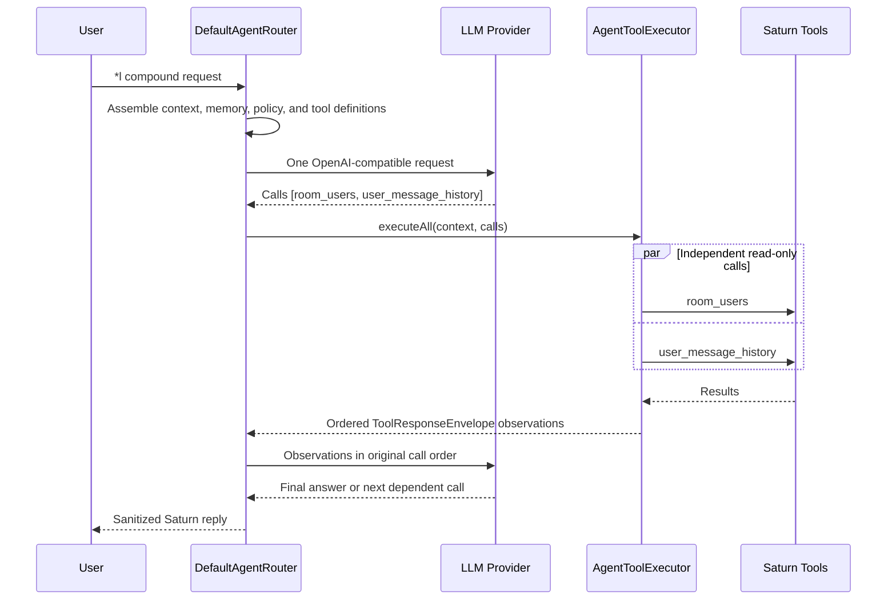

# Saturn Agentic Architecture

## Executive Overview

Saturn's agentic layer turns direct `*l` requests, exact mentions, approved ambient turns, and
autonomous moderation signals into bounded OpenAI-compatible tool-calling sessions. It orchestrates
existing Saturn commands, room state, and read-only persistence queries; it is not a second command
framework.

The package root is `org.saturn.app.agent`. Provider integration lives in `agent.llm`, concrete
tools in `agent.tool`, SQLite-backed context and memory in `agent.persistence`, and ambient abuse
monitoring in `agent.moderation`. `AgentRuntimeFactory` constructs the runtime.

The provider selects from advertised tools. Saturn remains authoritative for capability checks,
schema validation, ordering, timeouts, result validation, room delivery, and persistence.

## Core Components

### Router And Planning

`DefaultAgentRouter` implements `AgentRouter` and owns a complete agent turn.

1. It validates prompt size and locks a striped session key. Public conversations share a room
   session; whispers use private user-and-room sessions.
2. `AgentRequestAssembler` combines the system policy, bounded memory, room context, invocation
   metadata, and the tool definitions available to the caller.
3. The provider may return zero, one, or many function calls in one response. The system policy
   asks it to decompose compound requests and emit independent lookups together.
4. The router adds results as tool observations, requests the next action or final synthesis, and
   persists successful public replies and tool evidence.

The router also enforces fresh user-history grounding, command-channel correction, stale-response
detection, response sanitization, and mode-specific reply behavior. Corrective provider calls are
bounded and do not grant tools additional authority.

### Execution Engine

`AgentToolExecutor` is created and closed per routed request. Its request-local state tracks
completed and in-flight invocation keys, per-tool call/failure counts, disabled tools, and satisfied
prerequisites.

For each call it resolves the contextual tool, validates the descriptor and JSON arguments, rejects
duplicates and unmet prerequisites, executes on a virtual thread with a bounded timeout, validates
the successful result schema, and returns a `ToolResponseEnvelope`. Malformed arguments, timeouts,
and tool exceptions become coded observations rather than crashing the router.

`AgentExecutionState` separately limits model/tool loop steps and total calls. `AgentConfig`
supplies `maxSteps`, `maxToolCallsPerTurn`, `maxCallsPerTool`, and `toolTimeoutMillis`.

## Configuration

`AgentConfig` is the typed source for provider and router settings. TOML under `[agent]` provides
checked-in defaults; non-blank `SATURN_AGENT_*` environment values take precedence. The agent
defaults to disabled and uses `http://localhost:16261` only as a safe local fallback. Enable it
only after setting `SATURN_AGENT_ENDPOINT` for the target environment.

Sensitive credentials never belong in TOML. `apiKeyEnv` names the environment variable holding the
token and defaults to `SATURN_AGENT_API_KEY`. The normal deployment variables are:

| Environment variable | Overrides |
| --- | --- |
| `SATURN_AGENT_ENABLED`, `SATURN_AGENT_ENDPOINT`, `SATURN_AGENT_MODEL` | Agent activation and provider selection. |
| `SATURN_AGENT_API_KEY` | Bearer token named by `apiKeyEnv`. |
| `SATURN_AGENT_TIMEOUT_SECONDS`, `SATURN_AGENT_MAX_COMPLETION_TOKENS`, `SATURN_AGENT_THINKING_ENABLED` | Provider request behavior. |
| `SATURN_AGENT_MAX_STEPS`, `SATURN_AGENT_MAX_TOOL_CALLS_PER_TURN`, `SATURN_AGENT_MAX_CALLS_PER_TOOL`, `SATURN_AGENT_MAX_TOOL_FAILURES`, `SATURN_AGENT_TOOL_TIMEOUT_MILLIS` | Bounded execution behavior. |
| `SATURN_AGENT_MAX_CONCURRENT_REQUESTS`, `SATURN_AGENT_MAX_PROMPT_CHARS`, `SATURN_AGENT_MAX_OUTPUT_CHARS`, `SATURN_AGENT_MEMORY_TURNS`, `SATURN_AGENT_MEMORY_TTL_HOURS`, `SATURN_AGENT_MAX_RETRIES`, `SATURN_AGENT_RETRY_BACKOFF_MILLIS` | Queue, payload, memory, and retry limits. |
| `SATURN_AGENT_DYNAMIC_SQL_*` | Dynamic-SQL enablement and every SQL size/time bound. |

Use [`.env.example`](.env.example) as the complete sanitized template. The conservative defaults
are five model/tool steps and a 10-second tool timeout. `AgentSqlConfig` applies the same
environment-first pattern to dynamic-SQL limits.

### Tool Contracts And Metadata

Every `AgentTool` publishes an `AgentToolDescriptor`; `AgentToolDefinitionFactory` serializes it
as an OpenAI function definition. The descriptor includes stable identity, capability/access
requirements, side effect, result-delivery mode, JSON parameter and result schemas, positive and
negative routing guidance, examples, prerequisite tools, idempotency, and timeout.

`read_only` is derived from `ToolEffect.READ_ONLY`. Legacy read-only descriptors are idempotent by
default, but new tools should declare their metadata explicitly. The model-visible result protocol
is always one of:

```json
{"status":"success","data":{}}
{"status":"error","data":null,"error":{"code":"...","message":"..."}}
```

## Tool Execution Policy

### Sequential First

Side effects and ordering are Saturn's default. `run_command` always runs sequentially, including
weather and time, because commands may deliver room output. Moderation, room messaging, writes,
and any descriptor with prerequisites retain provider order.

### Selective Read Parallelism

The executor fans out a *contiguous* batch only when every call is read-only, idempotent, and has
no prerequisite. `room_users`, `user_message_history`, and eligible named read-only queries can
qualify. Results are collected and appended to the model context in the original provider-call
order. A command before or after a read batch is an ordering barrier.

### Latency Strategy

The main optimization is allowing several independent calls in one provider response, avoiding a
provider round trip. Local virtual-thread fan-out is a safe secondary optimization; it never
relaxes action ordering.

## Multi-Tool Lifecycle



For weather plus two room counts, the model can emit weather and the first lookup together. Weather
uses `run_command` and stays sequential; only an independent read-only batch can fan out. A second
room lookup is a later turn when it depends on prior observations.

## Built-In Tools

| Tool | Role | Execution Rule |
| --- | --- | --- |
| `room_users` | Live user list and count for a managed room. | Independent read-only calls may fan out. |
| `user_message_history` | Up to 500 public messages for one user with evidence metadata. | Independent read-only calls may fan out. |
| `database_query` | Named read-only application queries. | Read-only, subject to descriptor constraints. |
| `database_schema` | Admin schema inspection for dynamic SQL. | Ordered prerequisite for `database_sql`. |
| `database_sql` | Admin-only, AST-validated generated `SELECT`. | Sequential; requires schema inspection. |
| `run_command` | Approved informational and moderation commands. | Always sequential; may deliver room output. |

Tool visibility is contextual. The registry omits unavailable tools, and `RunCommandTool` publishes
only commands permitted by the current capabilities. The executor enforces the same rules again at
runtime, so provider payloads are never authorization.

## Extension Guide

For a new tool, follow [the command skill](.skills/adding-saturn-command/SKILL.md) when it invokes
Saturn commands, then implement `AgentTool`, publish a closed parameter schema and result schema,
declare effect/idempotency/timeout/capabilities, register it in `AgentRuntimeFactory`, and add
validation, ordering, timeout, and capability tests. Update resource-based tool copy under
`src/main/resources/agent/` as part of the same change.

Never mark an action tool read-only or idempotent merely because it is commonly informational. Only
a successful tool result, never model prose, proves that a lookup or command occurred.

## Related Documentation

- [Tool routing rules](TOOL_ROUTING_ARCHITECTURE.md)
- [SDK hardening checklist](HARDENING_CHECKLIST.md)
- [Agentic refactoring notes](REFACTORING.md)
- [Runtime configuration](README.md#vaelen-agent)
