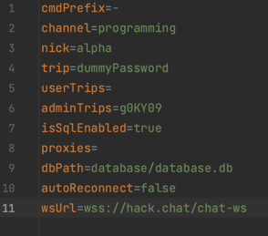

# Saturn Project

`Saturn` is a Moderator Bot made for `Hack.Chat` (_https://github.com/hack-chat_ ) project. 

## Getting started

You may clone the project and step into the `saturn/` directory before proceeding.

Make sure Java 17 or above is installed.
```bash
git clone https://github.com/ArteomBalanuta/saturn.git
cd saturn
```

### 1. Creating and setting up the database
Before proceeding make sure `sqlite3` is installed and available in your terminal.
```bash
/bin/bash /deploy/create_db.sh
```
Check `database.db` is created in `database/` directory.

Adjust `application.properties` configuration file in root directory, set the flag:

`dbPath=database/database.db`

### 2. Compiling the application
Make sure `maven` is set up and is discovered:
```bash
mvn -version
```

Build the project, Jar file `saturn.jar` will be generated in `target/` directory:
```bash
mvn clean package
```

### 3. Adjust the application.properties configuration

Example:
`wsUrl=wss://hack.chat/chat-ws` Chat's WebSocket address.

`cmdPrefix=-` Command prefix used to trigger the bot.

`channel=programming` Channel used by the bot.

`nick=alpha` Bot's nick.

`trip=ab13` Bot's trip.

`adminTrips=g0KY09,8Wotmg` Trip codes that are granted ADMIN role, full access.

`dbPath=database/database.db` Path do databse file. Relative/absolute path can be used.

`autoReconnect=false` Setting responsible for auto reconnect feature. Bot will try reconnect within 15 after connection were closed.





### 4. Run the application:

```bash
java -Dlog4j.configurationFile=./log4j2.xml -jar target/saturn.jar
```

### Notes

`Fat/Uber` JAR is generated: `/target/saturn.jar`. 

Feel free to move/deploy the application along with: 

`database.db, application.properties, log4j2.xml` files.


# _Have fun_
