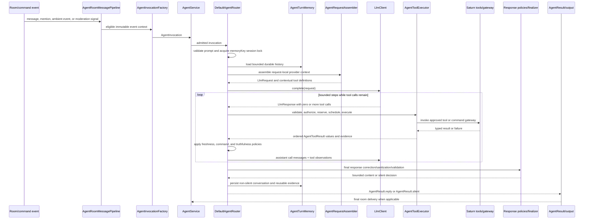

# Saturn Agentic Behavior

> **Document status:** implementation-grounded behavior guide.
>
> This document describes the behavior currently implemented under
> `src/main/java/org/saturn/app/agent`. It is a maintainer and product-boundary document, not a
> promise that the agent can perform arbitrary actions. The agent is deliberately bounded by
> immutable request context, advertised tool contracts, authorization, execution budgets, provider
> limits, persistence boundaries, and response-correction policies.

## 1. Agentic role

Saturn's agent is a bounded, stateful orchestration layer between room events and a language-model
provider. Its role is to:

- interpret a direct request, exact mention, eligible ambient message, or moderation signal;
- assemble a provider request from trusted context, bounded history, system policy, room context, and
  currently available tool definitions;
- let the provider propose a response or a structured batch of tool calls;
- validate, authorize, schedule, and execute those calls through Saturn-owned contracts;
- turn every outcome into truthful model-visible evidence and, where appropriate, room delivery;
- repeat the provider/tool turn only within explicit execution limits; and
- produce one bounded `AgentResult` or an intentional silent result.

The agent does **not** replace Saturn's command framework, persistence layer, moderation system, or
provider adapter. It coordinates those systems through narrow interfaces. The provider proposes;
Saturn remains authoritative for identity, capabilities, tool availability, command authorization,
argument/result schemas, ordering, timeouts, persistence, and final room output.

### Capability boundary

The agent can expose capabilities already represented by Saturn-owned tools, including contextual
room/user reads, schema and database reads, bounded SQL-backed queries, approved command execution,
and user-message history retrieval. Exposure is contextual rather than global:

- `AgentTool.isAvailableTo(AgentContext)` decides whether a tool is visible for the current caller.
- `AgentToolDescriptor` declares the tool's access level, effect, result mode, schemas, prerequisites,
  idempotency, timeout, and resource metadata.
- `SaturnCommandGateway` remains the execution boundary for Saturn commands.
- `AgentToolExecutionPolicy` and `AgentToolExecutionLedger` prevent unsafe or duplicate execution.
- Moderation invocations are narrowed to the explicitly allowed moderation command path.

A tool being advertised is not proof that the provider may invoke it successfully. Every call is
resolved again against the current context and execution policy.

## 2. Ingress modes and intent

The room layer turns external events into immutable `AgentInvocation` values. The invocation carries
an identifier, `AgentContext`, prompt, mode, optional current-message text, and whether the request
originated from a command path.

| Mode | Typical ingress | Conversational behavior | Security/identity significance |
| --- | --- | --- | --- |
| `DIRECT` | `*l <prompt>` or whisper command | A user-visible answer is expected. | The caller's direct identity and command origin are retained. |
| `MENTION` | Exact public `@<bot-nick>` mention | A user-visible answer is expected. | Public room context is available; command-origin restrictions remain. |
| `AMBIENT` | Eligible sampled public message | No acknowledgement is required; silence is normal. | Eligibility, quiet state, moderation, and participation policy are applied before admission. |
| `MODERATION` | Semantic moderation candidate | Conversational output is silent. | The invocation carries moderation context and is restricted to the approved moderation action path. |

`AgentRoomMessagePipeline` applies deterministic checks before routing: moderation state, protected
principals, quiet requests, bot/self filtering, mention recognition, eligibility, and ambient
participation policy. `AgentInvocationFactory` snapshots the relevant room users, caller identity,
whisper state, capabilities, and current message rather than allowing downstream code to read an
unstable room event repeatedly.

The public compatibility facade is `DefaultAgentRoomAutomation`; composition is performed by
`AgentRuntimeFactory`, `AgentInfrastructureFactory`, `AgentRouterFactory`, and
`AgentToolRegistryFactory`.

## 3. End-to-end lifecycle



### 3.1 Admission and invocation creation

1. A direct command or room event enters the room/command layer.
2. The pipeline rejects events that are not eligible before provider work is scheduled.
3. The factory creates an `AgentInvocation` with a request ID and immutable contextual snapshot.
4. `AgentServiceImpl` admits work subject to enabled/shutdown state, concurrency permits, and the
   separate ambient latest-value queue. Ambient submissions may coalesce; direct and mention work
   retains its explicit admission behavior.

### 3.2 Session resolution

`DefaultAgentRouter.route` first enforces the configured prompt bound, then serializes the invocation
under `AgentContext.memoryKey()`. The lock is acquired before stateful history, tool evidence, and
final response persistence are coordinated. This prevents two turns for one logical conversation
from interleaving their reads, tool observations, or writes.

The lock manager uses 64 fair striped `ReentrantLock` instances. The same key always maps to the same
stripe. Different keys can collide and serialize conservatively; a stripe is not an exact per-key
lock. This is an intentional safety/performance trade-off, not a claim of unlimited parallelism.

### 3.3 Request assembly and provider projection

`AgentTurnMemory` loads bounded durable history and applies legacy-persona filtering where required.
`AgentRequestAssembler` combines:

- the invocation and its `AgentContext`;
- the rendered system prompt and policy state;
- recent room context where the mode permits it;
- bounded conversation history;
- contextual tool definitions from `AgentToolRegistry`; and
- the current user prompt.

`AgentMessageProjector` creates provider-facing copies. Durable `AgentMessageHistory` and persisted
memory are not used as mutable working buffers. When history must be reduced, assistant tool calls
and their tool-result observations remain a logical pair; provider sanitization must not leave an
orphaned tool result or a tool call with missing evidence.

Provider neutrality ends at `LlmClient`. `OpenAiCompatibleClient` owns HTTP, wire JSON, response
parsing, provider retry/backoff behavior, and provider-specific failure translation. The router
operates on `LlmRequest`, `LlmMessage`, `LlmResponse`, and `LlmToolCall` rather than provider JSON.

### 3.4 Provider response and bounded tool loop

A provider response can be a final response or a batch of proposed tool calls. The router maintains
request-local `AgentTurnState`, execution limits, evidence, and correction flags. For each iteration:

1. The response is required to be non-null and structurally usable.
2. Fresh-data policies may require an exact tool call before accepting a response.
3. Command-channel and unverified-action policies may correct or reject unsafe response forms.
4. Tool calls are checked against current definitions and contextual availability.
5. `AgentToolBudgetPolicy` reserves the batch within per-turn limits.
6. `AgentToolExecutor` validates and executes the calls through the ledger and scheduler.
7. Ordered tool results are recorded as model observations and/or room delivery.
8. The system prompt is refreshed with current request-local evidence where required.
9. The next provider request contains the assistant tool-call message and matching observations.

The loop terminates when the provider returns no tool calls, a policy produces a terminal outcome, a
configured step/call/failure limit is reached, or a routing/provider failure prevents safe
continuation. Exhaustion never becomes an invented success.

### 3.5 Final response and output

`AgentResponseCorrector`, `AgentResponseFinalizer`, and `AgentResponseSanitizer` enforce the final
boundary. They handle stale responses, malformed quote/action claims, internal evidence leakage,
failure placeholders, output bounds, correction loops, and mode-specific silence.

`AgentResult` is the router's final typed result:

- `AgentResult.reply` carries a bounded reply and correlation/request identity.
- `AgentResult.silent` represents intentional non-delivery, especially for ambient and moderation
  turns.

A successful tool call does not necessarily imply a conversational reply. Room delivery is a final
policy decision separate from tool execution success.

## 4. Context, memory, and evidence domain

### 4.1 `memoryKey` isolation

`AgentContext.memoryKey()` is both the session-serialization key and the durable-memory namespace.
The key is deliberately explicit:

- public context uses a length-prefixed room component followed by `|public`;
- whisper context uses the room component followed by the strongest available private identity:
  trip, then hash, then nick; and
- the length prefix avoids ambiguous concatenation when room names share prefixes.

Consequences:

- users in a public room share ordered public conversation memory;
- whisper turns do not accidentally reuse public-room memory; and
- two unrelated keys may still serialize when they collide on the striped lock manager.

### 4.2 Durable history versus provider context

`AgentMemoryStore` is the persistence boundary. `H2AgentMemoryStore` and the repository classes own
SQL/database mechanics; the router does not directly mutate database records. A turn uses a bounded,
request-local working copy. Provider trimming, projection, sanitization, and tool-message pairing
operate on that copy.

The central context invariant is:

> Provider-facing reduction may change what is sent for this request, but it must not mutate durable
> history, persisted evidence, or the next turn's source record.

Memory load and required final persistence failures are routing failures. They must not silently look
like an empty conversation or a successful response. Best-effort recent room-context loading may fall
back according to its explicit implementation policy, but that exception is not a license to ignore
required memory failures.

### 4.3 Evidence truthfulness

`AgentToolEvidence` and `AgentTurnState` distinguish attempted, successful, failed, and reusable tool
observations. Evidence can describe:

- successful data retrieval;
- denied or unavailable access;
- malformed arguments or schema failures;
- missing prerequisites or duplicate reservations;
- timeout, interruption, deadline, or explicit cancellation;
- provider/tool exceptions; and
- unknown or disabled tools.

These outcomes must not be rendered as successful actions. Correlation IDs and tool names remain
available for routing logs and bounded result envelopes, while sensitive implementation details are
kept out of model-visible or room-visible text as required by the renderer.

Conversation persistence happens only after final response validation. Reusable tool evidence is
persisted only when its delivery semantics permit it. A conversation append failure prevents the
subsequent evidence append; an evidence persistence failure can occur after the conversation pair is
already stored and is surfaced as a persistence/routing failure rather than hidden.

## 5. Tool-result visibility and capabilities

`ToolResultMode` controls how a tool result crosses boundaries:

| Mode | Model observation | Room delivery | Reusable cross-turn evidence |
| --- | --- | --- | --- |
| `MODEL_DATA` | Yes | Not inherently | Eligible when the result is valid and persistent evidence is permitted. |
| `ROOM_DELIVERY` | No ordinary model-data observation | Yes, through the tool's delivery path | No. |
| `ROOM_DELIVERY_AND_MODEL_DATA` | Yes | Yes | No; delivery-bearing results are not reused as durable model evidence. |

`AgentToolResultCoordinator` and `AgentModelVisibleToolResultRenderer` keep execution separate from
rendering. A renderer cannot execute a tool or turn a failed result into success. The final
`AgentResult.shouldReply` decision is independent of whether a tool produced a useful result.

## 6. Execution safety

The safe execution path is conceptually:

```text
provider proposal
  -> contextual definition lookup
  -> argument/schema validation
  -> capability and policy checks
  -> prerequisite and duplicate reservation
  -> exactly-once invocation
  -> timeout/deadline/cancellation handling
  -> result-schema validation
  -> typed outcome/evidence
  -> model/room rendering
```

`AgentToolExecutionLedger` owns request-local reservations, completed/in-flight keys, prerequisites,
per-tool and per-turn limits, failure tracking, and disabled-tool state. A rejected reservation or
policy decision must not invoke the handler. Observers and middleware observe the execution boundary;
they are not alternate executors.

For command-backed tools, `SaturnCommandGateway` remains authoritative. The agent may format and
validate a proposed command, but it cannot bypass gateway authorization, moderation restrictions,
protected-principal rules, or command-origin policy. Sensitive mutation without the required trusted
context fails closed.

Malformed arguments, unavailable tools, duplicate calls, invalid results, exceptions, and authorization
failures become explicit typed error outcomes. They do not cause the router to fabricate a successful
room action or silently re-run the call.

## 7. Concurrency and scheduling

The agent has two distinct concurrency boundaries:

1. **Session boundary:** `AgentSessionLockManager` serializes stateful work for the same
   `memoryKey`.
2. **Tool-batch boundary:** request-local virtual-thread execution may overlap only calls classified
   as safe independent reads.

`AgentToolCallScheduler` preserves provider order in the returned result list. Read-only calls may be
placed in contiguous parallel segments when the execution policy permits. Non-read, interactive,
unknown, prerequisite-bearing, or resource-conflicting calls act as barriers. Read/write and
write/write resource conflicts do not overlap. The scheduler is conservative and segmented; it is
not a general dependency DAG.

Batch state is represented by `AgentToolBatchContext` and `CancellationToken`. Deadlines, explicit
cancellation, interruption, and executor shutdown produce distinct bounded outcomes where the
contracts require them. The shared request-local virtual-thread executor is closed by the owning
facade; the scheduler does not silently create an unbounded global worker pool.

## 8. Correction and policy behavior

Correction policies are ordered guardrails around provider continuation, not hidden tool executors:

- `AgentFreshDataPolicy` and its coordinators require current tool evidence for requests that need
  fresh data.
- `AgentCommandChannelPolicy` protects structured command-channel responses and command-definition
  consistency.
- `AgentUnverifiedActionPolicy` rejects or corrects claims that an action happened without truthful
  supporting evidence.
- `AgentResponseCorrector` handles product-specific quote, stale-response, failure-placeholder,
  internal-evidence, and unverified-action cases.
- `AgentResponseSanitizer` removes legacy persona/internal presentation artifacts before output.
- `AgentResponseFinalizer` applies final response bounds, silence rules, and validation.

A correction may request another bounded provider turn, but it cannot bypass tool validation,
authorization, ledger reservation, or persistence rules. Correction failure is fail-closed: the system
returns a stable routing failure or silence according to the invocation mode.

## 9. Failure semantics and operational boundaries

The following are intentional boundaries rather than exceptional omissions:

- Prompt, output, history, tool-call, schema, step, failure, retry, and timeout values are bounded by
  `AgentConfig` and related policy records.
- Unknown or malformed provider responses do not enter the tool handler.
- Null or invalid context/configuration inputs fail at constructor or record validation boundaries;
  callers must not rely on null as an authorization signal.
- Authorization failures are not retried as provider failures.
- Tool timeout, interruption, deadline, and explicit cancellation are not reported as successful
  execution.
- Persistence failures are not converted into empty-memory success.
- Provider retry/backoff behavior belongs to the provider adapter and is not a universal router
  guarantee.
- Ambient and moderation silence is intentional output policy, not necessarily an error.
- A provider may propose multiple calls, but Saturn may serialize, reject, or partially fail them
  according to resource, prerequisite, budget, and authorization policy.
- RPC, MCP, external plugins, and arbitrary skill execution are not part of this in-process agent
  boundary unless a separately approved product extension adds them.

## 10. Maintainer source map

| Concern | Primary implementation |
| --- | --- |
| Invocation contracts and modes | `api/AgentInvocation.java`, `api/AgentContext.java`, `api/AgentInvocationMode.java` |
| Room/event ingress | `room/AgentRoomMessagePipeline.java`, `room/DefaultAgentRoomAutomation.java`, `routing/AgentInvocationFactory.java` |
| Admission/composition | `routing/AgentRuntimeFactory.java`, `routing/AgentInfrastructureFactory.java`, `routing/AgentRouterFactory.java` |
| Core loop | `routing/DefaultAgentRouter.java` |
| Request/context projection | `routing/AgentRequestAssembler.java`, `routing/AgentMessageProjector.java`, `routing/AgentPreparedRequest.java` |
| Provider boundary | `llm/LlmClient.java`, `llm/LlmRequest.java`, `llm/LlmResponse.java`, `llm/provider/openai/OpenAiCompatibleClient.java` |
| Tool contracts | `api/AgentTool.java`, `api/AgentToolDescriptor.java`, `tool/contract/AgentToolDefinitionFactory.java` |
| Validation and execution | `tool/execution/AgentToolCallValidator.java`, `AgentToolExecutionPolicy.java`, `AgentToolExecutionLedger.java`, `AgentToolExecutor.java` |
| Scheduling/cancellation | `tool/execution/AgentToolCallScheduler.java`, `AgentToolBatchContext.java`, `CancellationToken.java` |
| Command authorization | `tool/SaturnCommandGateway.java`, `tool/EngineSaturnCommandGateway.java`, `tool/RunCommandTool.java` |
| Memory/evidence | `turn/AgentTurnMemory.java`, `turn/AgentMessageHistory.java`, `turn/AgentToolEvidence.java`, `persistence/H2AgentMemoryStore.java` |
| Session locking | `room/AgentSessionLockManager.java` |
| Correction/final output | `routing/AgentResponseCorrector.java`, `AgentResponseSanitizer.java`, `AgentResponseFinalizer.java`, `api/AgentResult.java` |
| Configuration and limits | `config/AgentConfig.java`, `api/AgentExecutionLimits.java`, `tool/execution/AgentToolBudgetPolicy.java` |

## 11. Behavioral invariants checklist

A change to the agent layer should preserve these invariants:

- [ ] An `AgentInvocation` is immutable and carries the complete trusted request context.
- [ ] The same `memoryKey` cannot have interleaved stateful routing/persistence work.
- [ ] Durable history is never used as a mutable provider-projection buffer.
- [ ] Assistant tool calls remain paired with their matching tool observations after projection.
- [ ] Tool availability is checked against the current context, not only the original definition list.
- [ ] Authorization remains authoritative at `SaturnCommandGateway` and command-policy boundaries.
- [ ] A reservation failure, invalid argument, timeout, cancellation, or handler exception cannot
      become a fabricated success.
- [ ] Parallel scheduling is limited to policy-approved independent reads; barriers preserve safety.
- [ ] Results are returned in provider order even when safe reads execute concurrently.
- [ ] `ToolResultMode` controls model/room visibility independently from final conversational reply.
- [ ] Non-silent persistence occurs only after final response validation.
- [ ] Ambient and moderation silence remains intentional and mode-specific.
- [ ] Provider-specific retry/parsing behavior is not generalized into router guarantees.
- [ ] New extensions do not introduce an unscoped second executor, registry, authorization path, or
      persistence boundary.
