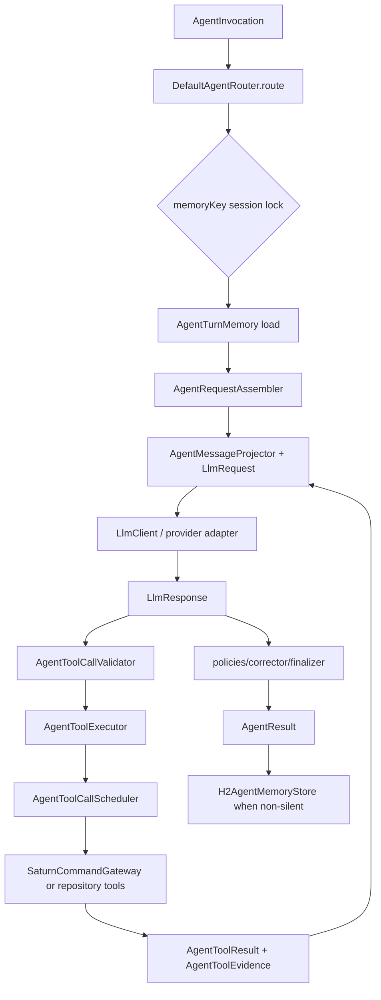

# Saturn Agent Architecture

> **Observed architecture:** This document records the current implementation. Recommendations are
> explicitly marked; unmarked statements cite source responsibilities.

## Core loop

`DefaultAgentRouter` is the stateful turn coordinator. The request assembler builds provider-neutral
messages and definitions; the provider adapter owns wire serialization/parsing. The executor owns
validation, authorization, deadlines, result validation, ledger updates, observers, and rendering;
the scheduler owns contiguous parallel-read batches and ordered result collection. The loop ends on
a final response, a policy stop, a bounded failure, or an exhausted tool/step budget.

## Context immutability invariant

`AgentInvocation`, `AgentContext`, `LlmRequest`, `LlmMessage`, and related records are value-oriented
boundaries. Durable history from `AgentMemoryStore` is treated as input. `AgentRequestAssembler`
creates request-local lists; `AgentMessageProjector` creates bounded provider projections rather than
mutating durable history. System-message replacement and tool-result continuation operate on copies.
Provider projections preserve assistant tool-call and tool-result pairing, remove legacy persona
turns, and enforce context budgets. This is an observed invariant, not a claim that arbitrary
caller-owned mutable JSON objects are immutable.

## Exactly-once ledger and authoritative gateway

Before invocation, `AgentToolCallValidator` resolves the contextual descriptor, parses/canonicalizes
arguments, checks schema and access, and returns an immutable `ValidatedToolCall`. The
`AgentToolExecutionLedger` reserves an invocation key, rejects duplicate/in-flight keys, enforces
per-tool calls and failure limits, tracks prerequisites, and records success/failure. Reservation
and completion are synchronized and request-local, so duplicate provider calls do not execute twice
within a turn. This is exactly-once admission for a request, not a distributed transaction guarantee.

`SaturnCommandTool` delegates command side effects to `SaturnCommandGateway`, whose engine-backed
implementation remains authoritative for command lookup, authorization, and execution. The model,
observers, renderers, and ledger never execute a command directly. Tool outcomes are validated and
converted to explicit success/error envelopes; malformed arguments/results, denied access, unknown
names, exceptions, timeouts, and cancellation cannot become successful action claims.

## Concurrency and barriers

Tool execution is request-local and uses a thread-per-task/virtual-thread executor. The scheduler
runs side effects, prerequisite-bearing calls, unknown/conflicting resources, and non-idempotent
calls sequentially. It may fan out only a contiguous batch where every call is read-only,
idempotent, prerequisite-free, and resource-compatible. Results are collected and emitted in original
provider order even when work finishes out of order. A batch barrier waits before later dependent
calls. Cancellation tokens and deadlines stop admission and are propagated to execution; timeout or
cancellation is an error observation.

This is segmented batching, not a general dependency DAG. Unknown resource metadata is treated
conservatively. Observers receive outcomes for telemetry only and cannot invoke tools.

## State, memory, and locking

`AgentSessionLockManager` maps each `AgentContext.memoryKey()` onto one of 64 fair striped locks.
Same-key turns serialize routing, observation accumulation, finalization, and persistence. Different
keys may run concurrently on different stripes; hash collisions intentionally serialize unrelated
keys. `H2AgentMemoryStore` is the durable boundary and uses `H2TransactionExecutor` for commit,
rollback, and connection-state restoration. Conversation history and reusable evidence are appended
only after non-silent finalization, with conversation persistence before evidence persistence.

`ToolResultMode` separates execution from visibility: `MODEL_DATA` is model-visible and reusable;
`ROOM_DELIVERY` is user/room-visible and not reusable; `ROOM_DELIVERY_AND_MODEL_DATA` has both
immediate channels but is not cross-turn reusable. `AgentResult.silent` independently suppresses
conversational output and persistence.

## Compatibility and security invariants

1. Provider-neutral contracts (`LlmRequest`/`LlmResponse`) isolate provider-specific JSON.
2. Capability and command authorization precede side effects; protected moderation/admin paths are
   mode-aware.
3. SQL tools pass through read-only AST policy and bounded repositories.
4. JSON schema and result-envelope validation fail closed.
5. Prompt, output, history, tool-call, timeout, and retry limits are explicit configuration.
6. Request IDs/correlation IDs are retained in routing failures and results/logs.
7. Source paths and symbols referenced here are repository-relative and current.

Edge cases include disabled tools after repeated failures, partial parallel batches, provider
responses truncated before completion, malformed internal evidence, correction failure, persistence
failure after conversation write, and intentional no-reply ambient/moderation turns. These are
represented as bounded failure or silent outcomes rather than fabricated success.

## Source index

- Routing: `src/main/java/org/saturn/app/agent/routing/DefaultAgentRouter.java`,
  `AgentRequestAssembler.java`, `AgentMessageProjector.java`.
- Safety/execution: `src/main/java/org/saturn/app/agent/tool/execution/AgentToolCallValidator.java`,
  `AgentToolExecutionLedger.java`, `AgentToolCallScheduler.java`, `AgentToolExecutor.java`.
- Gateway: `src/main/java/org/saturn/app/agent/tool/SaturnCommandGateway.java`,
  `EngineSaturnCommandGateway.java`, `SaturnCommandTool.java`.
- Persistence/locking: `src/main/java/org/saturn/app/agent/persistence/H2AgentMemoryStore.java`,
  `H2TransactionExecutor.java`, `room/AgentSessionLockManager.java`.
